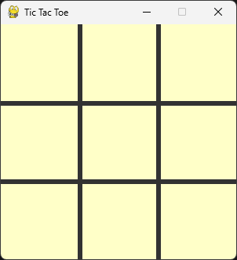
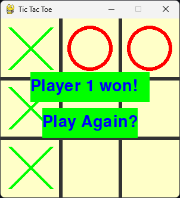
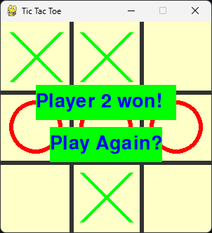

# Tic Tac Toe Game

This is a simple implementation of the classic Tic Tac Toe game in Python.

## How to Play
To play the game, run the `main.py` file in a Python environment. Follow the on-screen instructions to take turns placing your 'X' or 'O' on the 3x3 grid. The first player to get three of their marks in a row (horizontally, vertically, or diagonally) wins the game.

## Features
- Simple command-line interface
- Two-player mode
- Error handling for invalid input

## Installation
1. Clone the repository
2. Navigate to the project directory
3. Run the `main.py` file

Enjoy the game!

## images
  